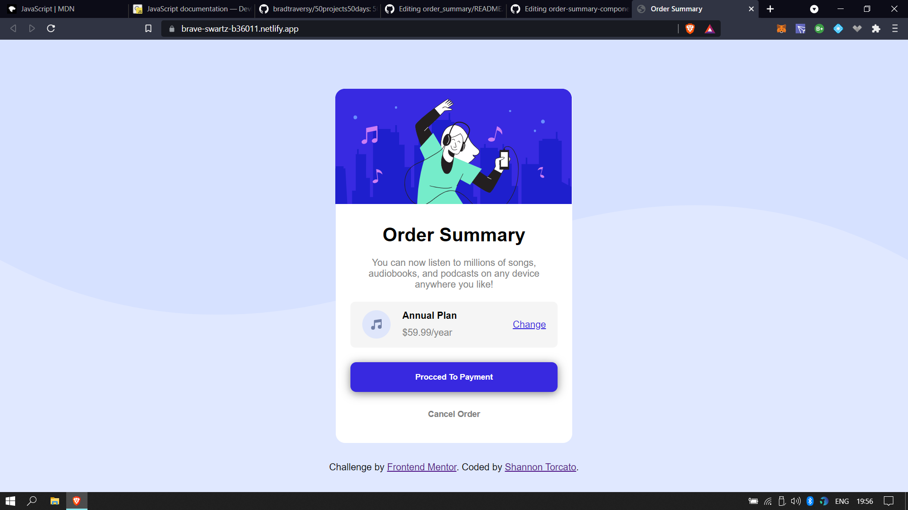

# Frontend Mentor - Order summary card

This is a solution to the [Order summary card challenge on Frontend Mentor](https://www.frontendmentor.io/challenges/order-summary-component-QlPmajDUj). Frontend Mentor challenges help you improve your coding skills by building realistic projects.

## Welcome! 👋

## Table of contents

- [Overview](#overview)
  - [The challenge](#the-challenge)
  - [Screenshot](#screenshot)
  - [Links](#links)
- [My process](#my-process)
  - [Built with](#built-with)
<!--   - [What I learned](#what-i-learned)
  - [Continued development](#continued-development)
  - [Useful resources](#useful-resources)
- [Author](#author)
- [Acknowledgments](#acknowledgments) -->

## Overview

### The challenge

Users should be able to:

- See hover states for interactive elements

### Screenshot

[Click Here For Preview](https://brave-swartz-b36011.netlify.app/)
### Links

- Solution URL: [Solution URL](https://www.frontendmentor.io/solutions/order-summary-using-css-grids-7gFVri0jr)
- Live Site URL: [Live site URL](https://brave-swartz-b36011.netlify.app/)

## My process

### Built with

- Semantic HTML5 markup
- CSS custom properties
- Flexbox
- CSS Grid
